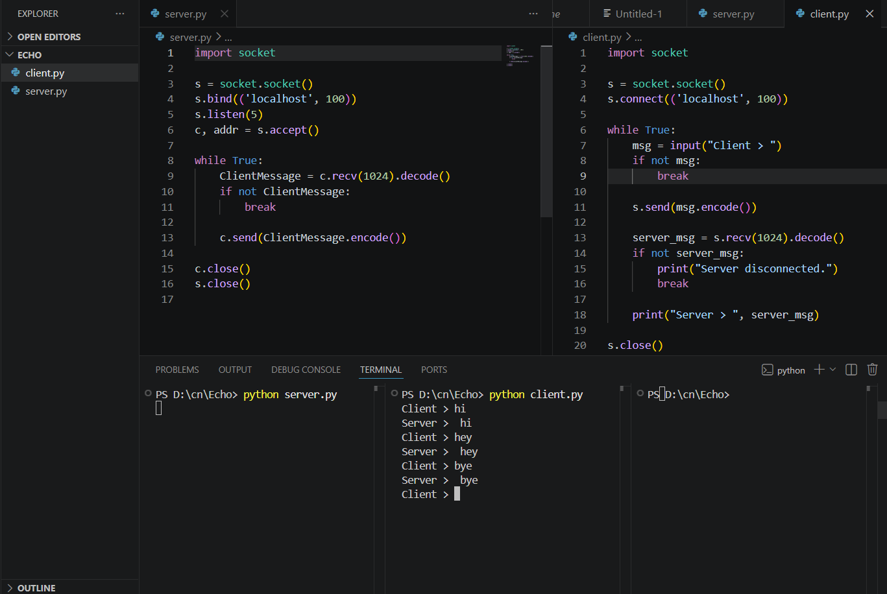

# 3a.CREATION FOR ECHO CLIENT AND ECHO SERVER USING TCP SOCKETS
# AIM
To write a python program for creating Echo Client and Echo Server using TCP
Sockets Links.
## ALGORITHM:
1. Import the necessary modules in python
2. Create a socket connection to using the socket module.
3. Send message to the client and receive the message from the client using the Socket module in
 server .
4. Send and receive the message using the send function in socket.
## PROGRAM:

CLIENT:

import socket

s = socket.socket()
s.connect(('localhost', 100))

while True:
    msg = input("Client > ")
    if not msg:
        break

    s.send(msg.encode())

    server_msg = s.recv(1024).decode()
    if not server_msg:
        print("Server disconnected.")
        break

    print("Server >", server_msg)

s.close()

SERVER:

import socket

s = socket.socket()
s.bind(('localhost', 100))
s.listen(5)

c, addr = s.accept()

while True:
    ClientMessage = c.recv(1024).decode()
    if not ClientMessage:
        break

    c.send(ClientMessage.encode())

c.close()
s.close()

## OUTPUT:

Thus, the python program for creating Echo Client and Echo Server using TCP Sockets Links 
was successfully created and executed.
